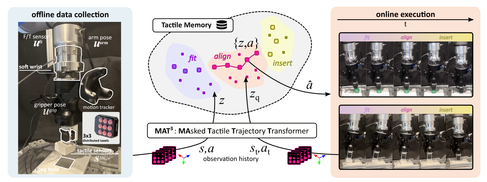
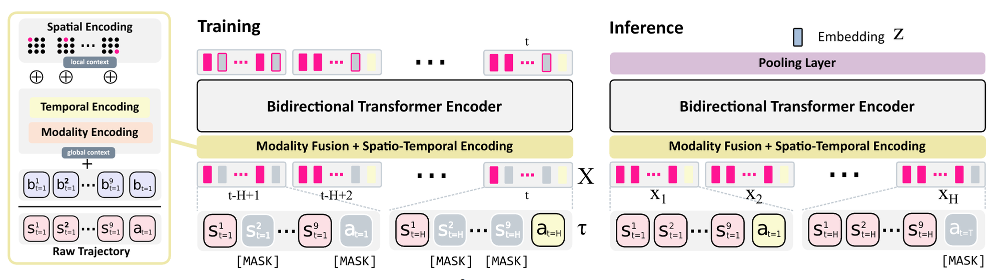

<div align="center">
<h1>Tactile Memory With Soft Robot: Robust Object Insertion via Masked Encoding and Soft Wrist</h1>

<p align="center">
    Tatsuya Kamijo &nbsp;
    Mai Nishimura &nbsp;
    Nodoka Shibasaki &nbsp;
    Jeremy Siburian &nbsp;
    Cristian C. Beltran-Hernandez &nbsp;
    Masashi Hamaya
</p>
<!-- TODO: affiliations -->

<p align="center">
    <b>IEEE Robotics and Automation Letters (RA-L), 2026</b>
</p>

<p align="center">
    <a href="https://doi.org/10.1109/LRA.2026.3692097"></a>
    <a href="https://omron-sinicx.github.io/tameso/"></a>
    <a href="LICENSE"></a>
    <a href="https://github.com/huggingface/lerobot"></a>
    <a href="https://github.com/gradio-app/trackio"></a>
    <a href="https://pixi.prefix.dev/latest/"></a>
</p>

</div>

---

<p align="center">
    
</p>

## 📄 Overview

**TaMeSo** (**Ta**ctile **Me**mory with **So**ft robot) performs robust peg-in-hole insertion with a
soft-wrist robot by *retrieving* actions from a memory of tactile experiences.

* **Offline data collection.** Demonstrations are recorded with a soft wrist, an F/T sensor, arm and
  gripper poses, a motion tracker and 3×3 distributed tactile sensors (Contactile).
* **Tactile Memory.** Every observation history (tactile readings, proprioception and actions) is
  encoded by **MAT<sup>3</sup>** into an embedding $z$ and stored together with its action $a$ as
  $\lbrace z, a \rbrace$. Embeddings of the *fit*, *align* and *insert* phases form distinct regions.
* **Online execution.** The current observation history is encoded into a query $z_q$, and the action
  $\hat{a}$ of one of its nearest neighbours in the memory is executed.

This repository contains **MAT<sup>3</sup>** (**MA**sked **T**actile **T**rajectory **T**ransformer),
the encoder that builds the tactile memory, and the retrieval on top of it:

* the MAT<sup>3</sup> encoder: `src/mat3/model.py`, masking strategies in `src/mat3/masking.py`
* pre-training with masked token prediction: `src/mat3/train.py` (logged with [trackio](https://github.com/gradio-app/trackio))
* the tactile memory (HNSW nearest-neighbour index), a retrieval policy and offline evaluation:
  `src/mat3/retrieval.py`, `src/mat3/scripts/`

## 🧩 MAT<sup>3</sup> (Masked Tactile Trajectory Transformer)

<p align="center">
    
</p>

MAT<sup>3</sup> maps a sub-trajectory of the observation history

$$\tau = \left( \lbrace s_{t-H+1}, a_{t-H+1} \rbrace, \dots, \lbrace s_t, a_t \rbrace \right)$$

to a compact key $z_t$ that is stored in the tactile memory together with the action $a_t$.

* **Modality fusion and spatio-temporal encoding.** Every time step is tokenised into 9 taxel tokens
  $s^1, \dots, s^9$ (3-D force of each taxel) and one action token $a$. Each token is concatenated
  with a fixed 2-D sinusoidal *spatial* encoding of its position on the 3×3 grid (local context).
  The F/T and pose signals (global context) and a *temporal* encoding are fused into every token of
  the step by weighted soft-concatenation. A window becomes $X \in \mathbb{R}^{10 \times H \times d}$.
* **Bidirectional Transformer encoder.** $X$ is processed by a bidirectional Transformer encoder
  (4 layers, 8 heads, $d = 248 + 8 = 256$, feed-forward dimension 512).
* **Masked token prediction.** For every window a masking ratio is drawn from $\mathcal{U}(0, 0.6)$
  and taxel / action tokens are replaced by `[MASK]` with that probability. The model reconstructs
  the taxel readings and actions:

  $$\mathcal{L} = \mathcal{L}_{\mathrm{tactile}} + \mathcal{L}_{\mathrm{action}} \quad \text{(MSE)}$$

* **Inference.** The action token of the current step is masked (the current action is unknown at
  execution time) and the output tokens are average-pooled into $z$. At execution time, the $k$ nearest
  keys of $z_q$ under $\lVert z_q - z_i \rVert_2$ are retrieved with an HNSW index and one of them is
  sampled uniformly.

## 🛠️ Installation

`mat3` is a regular Python package (Python ≥ 3.12) and can be installed from the git repository:

```sh
pip install git+https://github.com/omron-sinicx/tameso.git
```

```sh
uv add git+https://github.com/omron-sinicx/tameso.git          # in a uv project
pixi add --pypi "mat3 @ git+https://github.com/omron-sinicx/tameso.git"  # in a pixi project
```

This installs the library and the commands `mat3-train`, `mat3-build-db` and `mat3-eval-db`
(the same entry points as the pixi tasks below).

### Development setup (pixi)

Install Pixi following the [official instruction](https://pixi.prefix.dev/latest/)

```sh
curl -fsSL https://pixi.sh/install.sh | sh
```

Clone the repository and install dependencies:

```sh
git clone https://github.com/omron-sinicx/tameso.git
cd tameso
pixi install
```

> All dependencies (PyTorch 2.7.1, LeRobot 0.6, vicinity, trackio, ...) are installed in the project directory (`.pixi/`). No global or system-wide packages are modified. No Docker needed.
> The pixi environment pins `torch==2.7.1`; the package itself accepts `torch>=2.7,<2.12`.

## 🚀 Available Tasks

List available tasks with `pixi task list`.

```
Task        Description
login-hf    Login to Hugging Face
train       Train the MAT^3 encoder (hydra overrides allowed)
debug       Tiny end-to-end run for debugging (2 epochs x 5 steps)
build-db    Encode the training split and build a vicinity DB
eval-db     Offline retrieval evaluation (position / rotation error)
dashboard   Open the trackio dashboard
```

## 📦 Dataset

The dataset is specified by its Hugging Face Hub id in [`src/mat3/conf/config.yaml`](src/mat3/conf/config.yaml)
and downloaded on first use; no separate download step is needed.

```yaml
data:
  repo_id: omron-sinicx/contactile_200_lota   # 64 episodes, 19,888 frames at 50 Hz
  revision: null                            # branch / tag / commit (default: main)
  root: null                                # local copy (default: $HF_LEROBOT_HOME/<repo_id>)
```

The dataset is read as **LeRobot v3.0** (`main` / tag `v3.0`; the original LeRobot v1.6 recording,
including the camera videos, is on the `v1.6` branch). For Hub repositories that only have LeRobot v1.6
files, the files are converted into the local cache automatically. Run `pixi run login-hf`
(or `hf auth login`) while the dataset is private.

| key | dim | used as |
|---|---|---|
| `observation.contactile` | 33 (11 pillars × xyz; the first 9 form the 3×3 grid) | 9 taxel tokens |
| `action.position_cmd`, `action.rotation_cmd` | 3 + 3 | action token / retrieved action |
| `observation.ft` | 6 | context |
| `observation.eef.position`, `observation.eef.rotation_ortho6` | 3 + 6 | context |
| `observation.vive_tracker_pose` | 7 | context |

Training options live in the same hydra config and can be overridden from the command line.
The trackio database is written to `TRACKIO_DIR` (default in the pixi environment: `./trackio`).

## 🧠 Training

```sh
pixi run debug                                   # smoke test (downloads the dataset on first use)
pixi run train                                   # default: 30 epochs, random masking ratio ~ U(0, 0.6)
pixi run train train.epochs=50 model.nlayers=2 logging.run_name=my-run
pixi run dashboard                               # trackio dashboard (loss curves)
```

Checkpoints are written to `outputs/<date>/<time>/models/{best,final}_model.pth`; they contain the
model config and the normalisation statistics, so nothing else is needed for inference.
Set `logging.space_id=<user>/<space>` to sync the trackio dashboard to a Hugging Face Space.

## 🔍 Vicinity Retrieval

```sh
RUN=outputs/<date>/<time>
pixi run build-db --checkpoint $RUN/models/best_model.pth          # -> $RUN/db/global_average_layer-1
pixi run eval-db  --checkpoint $RUN/models/best_model.pth --db $RUN/db/global_average_layer-1
```

```python
from mat3.retrieval import RetrievalPolicy

policy = RetrievalPolicy.from_pretrained(
    f"{RUN}/models/best_model.pth", f"{RUN}/db/global_average_layer-1", k=1
)
action = policy.predict(window)   # window: {key: array [H, dim]} of raw observations / past actions
                                  # (the current action is masked, its value is ignored)
                                  # -> [position_cmd (3), rotation_cmd (3)] of a retrieved demo
```

Retrieval must run in the control loop, so the database is an **approximate nearest-neighbour (HNSW)
index**. The default backend is `hnsw` ([hnswlib](https://github.com/nmslib/hnswlib));
[`voyager`](https://github.com/spotify/voyager) is also supported (`--backend voyager`).
Parameters (`--m`, `--ef-construction`, `--ef-search`) are stored with the database.
Measured on `contactile_200_lota` (15,910 keys of dim 256, the 3,978 validation windows as queries, one CPU core):

| backend | M / ef_construction / ef_search | recall@1 | latency / query |
|---|---|---|---|
| hnsw (**default**) | 32 / 400 / 400 | **0.983** | 0.11 ms |
| hnsw | 32 / 400 / 200 | 0.965 | 0.07 ms |
| voyager | 32 / 400 / 400 | 0.974 | 0.13 ms |
| voyager (original code: library defaults) | 16 / 200 / 10 | 0.541 | 0.02 ms |
| exact (numpy brute force) | n/a | 1.0 | 3.2 ms |

`--backend basic` (exact search) is available for analysis.

## 📝 Citation

```bibtex
@article{kamijo2026tactile,
    title   = {Tactile Memory With Soft Robot: Robust Object Insertion via Masked Encoding and Soft Wrist},
    author  = {Kamijo, Tatsuya and Nishimura, Mai and Shibasaki, Nodoka and Siburian, Jeremy and Beltran-Hernandez, Cristian C. and Hamaya, Masashi},
    journal = {IEEE Robotics and Automation Letters},
    volume  = {11},
    number  = {7},
    pages   = {7844--7851},
    year    = {2026},
    doi     = {10.1109/LRA.2026.3692097},
}
```

## ⚖️ License

This code is released under the [MIT License](LICENSE). It contains portions adapted from PyTorch
examples (BSD 3-Clause) and LeRobot (Apache License 2.0); see [THIRD_PARTY_NOTICES.md](THIRD_PARTY_NOTICES.md).
For commercial use, please contact us at contact@sinicx.com.
